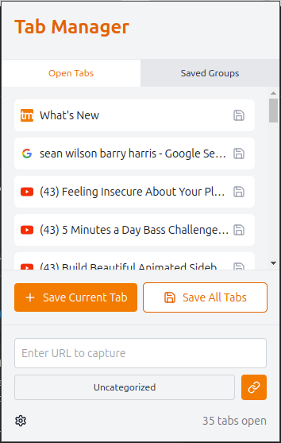
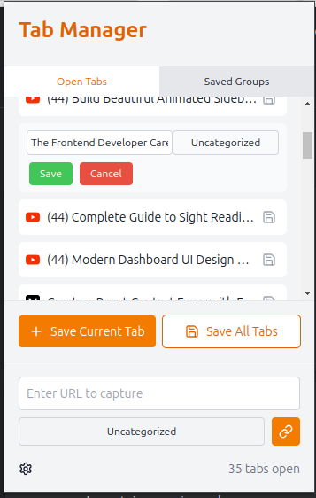
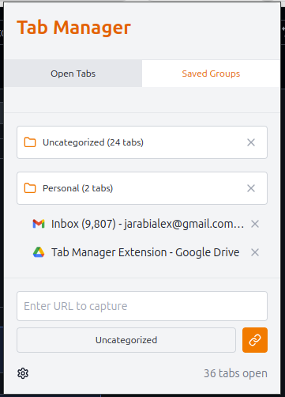

# Tab Manager Extension

A browser extension for managing and organizing open tabs, with Firebase integration for saving and categorizing tabs.

## Project Description

This Tab Manager Extension allows users to organize their browser tabs efficiently by saving them into categorized groups, editing their properties, and easily navigating between them. Integrated with Firebase, it provides persistent storage for saved tabs.

## Key Features

* Capture current open tabs and save them.
* Categorize tabs into custom groups (e.g., Work, Personal, Research).
* Edit tab details such as title and category.
* Expand/collapse saved tab categories.
* Navigate to a tab's URL with a click.
* Persist tab data using Firebase.
* Delete saved tabs from Firebase.
* Placeholder favicon support for tabs without favicons.

## Screenshots

### Main interface showing open tabs



### Editing a tab's details



### Saved tabs organized under categories.



## Installation

### Prerequisites

1. Node.js and npm installed.
2. A Firebase account for project configuration.

### Steps

+ Clone the repository.
+ Install dependencies: `npm install`
+ Set up Firebase configuration:
    + Create a `.env` file in the project root with the following keys:
    ```
    VITE_FIREBASE_API_KEY=<your-api-key>
    VITE_FIREBASE_AUTH_DOMAIN=<your-auth-domain>
    VITE_FIREBASE_DATABASE_URL=<your-database-url>
    VITE_FIREBASE_PROJECT_ID=<your-project-id>
    VITE_FIREBASE_STORAGE_BUCKET=<your-storage-bucket>
    VITE_FIREBASE_MESSAGING_SENDER_ID=<your-messaging-sender-id>
    VITE_FIREBASE_APP_ID=<your-app-id>
    ```
+ Start the development server: `npm run dev`
+ Load the extension:
    + Navigate to `chrome://extensions` (for Chrome) or equivalent for other browsers.
    + Enable "Developer mode."
    + Prepare the `dist` directory to load to Chrome extensions: `npm run build`
    + Click "Load unpacked" and select the `dist` directory.

## Usage

### Capturing and Managing Tabs
+ Click the "Save" icon next to a tab to edit its details and assign a category.
+ Click "Capture Current Tab" to save current open tab.

### Navigating and Expanding Categories

+ Click on a category header to expand/collapse the saved tabs under it.
+ Click on a tab to open its URL in a new browser tab.

### Managing Saved Tabs
+ Use the "X" button to delete a saved tab from the category.

## Configuration

Currently, the categories are managed directly in the code. Future updates will allow for users to update/add their own categires.

## Firebase Integration

+ Real-time data synchronization for saved tabs.
+ Database structure for organizing tabs by category.

## Development and Contribution

+ Running the development server.
+ Building the extension for production (npm run build).

### Contribution guidelines:

+ Pull request process.
+ Coding standards.

## Known Issues and Limitations

1. The application will not run on localhost. It needs to be upladed to chrome extensions to run.
2. Users cannot yet search for saved tabs.
3. Saved categories cannot yet be removed at once, in case user wants to delete a saved group.

## Future Enhancements

+ Syncing tabs across devices.
+ Adding tags or custom metadata to tabs.
+ Enhancing search functionality.

## License

MIT License.

## Acknowledgments

These tools and reources helped me immensely in realizing this project:
+ v0: Generating UI using user queries
+ Chat-GPT: Helped troubleshooting bugs in the code
+ Firebase: Databasse envirenment for saving tabs
+ @radix-ui: Library for React UI element to save on development time
+ lucide-react: React icon library